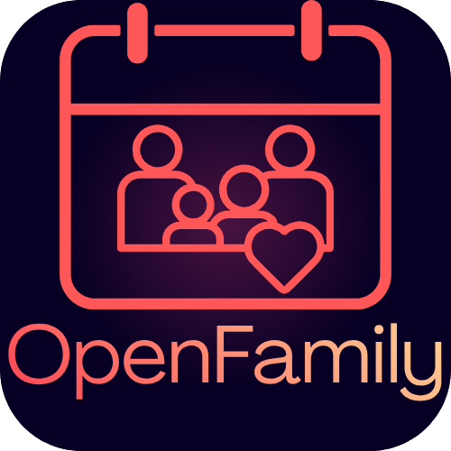
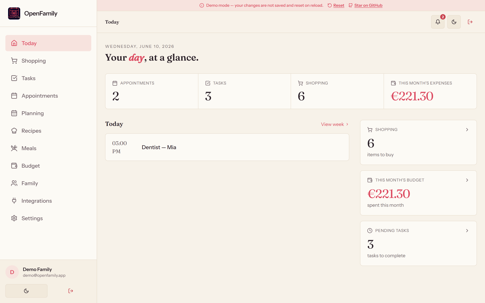
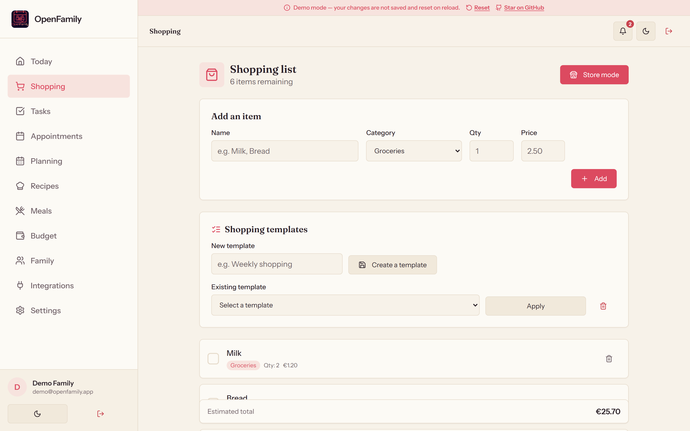
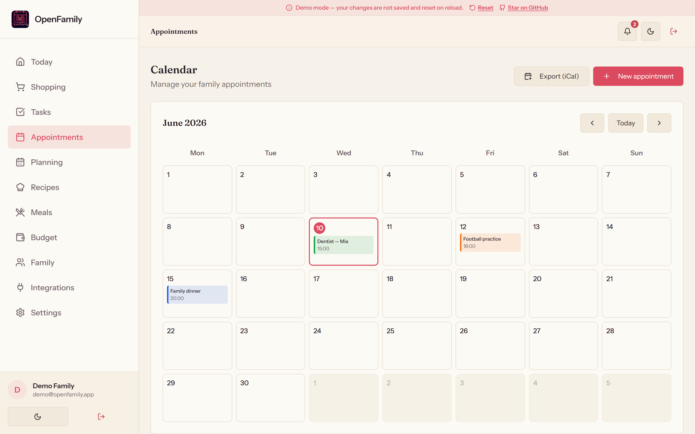
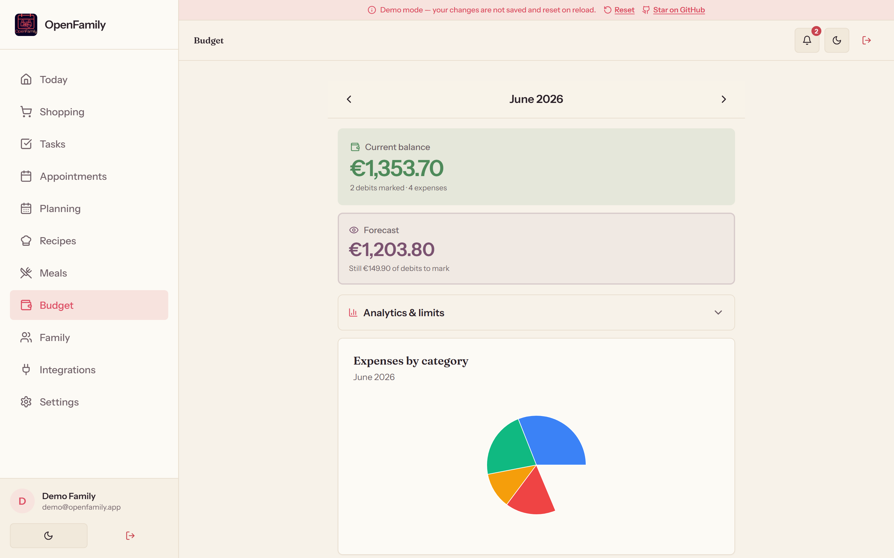
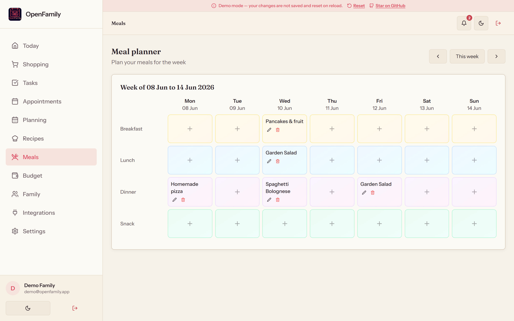
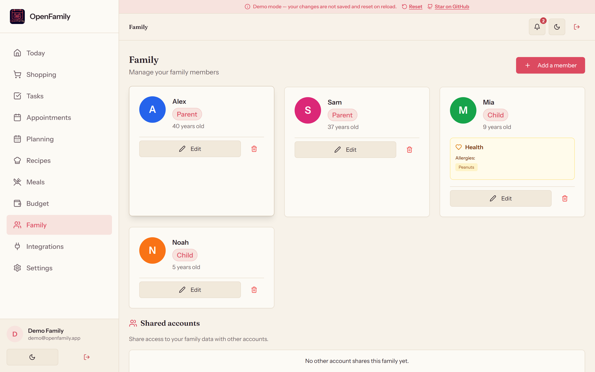
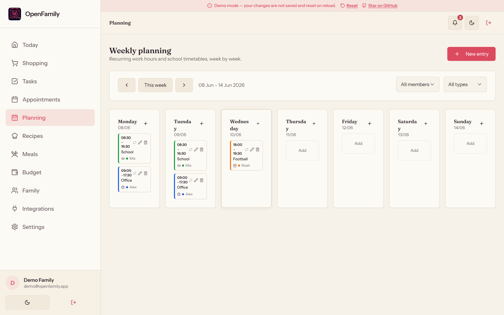

<div align="center">
  
  <h1>OpenFamily</h1>
  <p><strong>开源、自托管的家庭管理工具</strong><br>
  完全掌控你的家庭数据——在自己的服务器上运行。</p>

  🇬🇧 <a href="README.md">English</a> · 🇫🇷 <a href="README.fr.md">Français</a> · 🇨🇳 <strong>简体中文</strong>

  [](https://github.com/NexaFlowFrance/OpenFamily/releases/latest)
  [](https://github.com/NexaFlowFrance/OpenFamily/actions/workflows/ci.yml)
  [](https://nexaflowfrance.github.io/OpenFamily/demo/)
  [](https://github.com/NexaFlowFrance/OpenFamily/pkgs/container/openfamily-client)
  [](licence.md)
  [](https://github.com/NexaFlowFrance/OpenFamily)
</div>

---

<div align="center">

### 🎬 [在线体验 →](https://nexaflowfrance.github.io/OpenFamily/demo/)

*无需注册，完全在浏览器中运行，不会保存任何数据。*



</div>

OpenFamily 是 **Cozi 和 FamilyWall 等应用的自托管替代方案**：将购物清单、
任务、共享日历、每周计划、食谱、餐食计划和家庭预算整合在一起——
运行在**你自己**的服务器上，管理**你自己**的数据。

## ✨ 功能

| | |
|---|---|
| 🛒 **购物清单** | 类别、价格、数量、模板以及**按商店区域整理的采购模式** |
| ✅ **任务** | 重复任务、家庭成员分配、统计数据 |
| 📅 **日程** | 月视图日历、自动提醒、颜色标记、**iCal 导出（.ics / webcal）** |
| 🗓️ **每周计划** | 按家庭成员管理工作时间和课程安排 |
| 🍳 **食谱** | 家庭食谱库、高级筛选、准备和烹饪时间 |
| 🍽️ **餐食计划** | 每周视图、PDF 导出、关联食谱 |
| 💰 **预算** | 每月跟踪、**图表**、**分类限额和警报**、定期扣款 |
| 👨‍👩‍👧‍👦 **家庭** | 成员档案、健康信息、紧急联系人 |
| 🔄 **实时同步** | 通过 WebSocket 在所有设备之间即时更新 |
| 🔔 **通知** | 日程提醒、任务警报（Web Push VAPID）和应用内通知 |
| 👥 **共享账号** | 通过链接邀请、**访问请求**、**所有权转让** |
| 🛡️ **角色与权限** | **家长/孩子**账号——孩子只能以只读方式查看预算 |
| 🌍 **多语言** | 支持**英语/法语/简体中文**界面和自动检测 |
| 📴 **离线模式** | 无网络连接时仍可浏览缓存数据（PWA） |

## 📸 界面截图

| 购物（采购模式） | 日历 | 预算 |
|---|---|---|
|  |  |  |

| 餐食计划 | 家庭 | 每周计划 |
|---|---|---|
|  |  |  |

## 🔗 第三方集成

一键将 OpenFamily 连接到你的自托管生态系统，无需编辑配置文件。

| 应用 | 类型 | 同步内容 |
|---|---|---|
| **Mealie** | 🍲 食谱 | 自动导入所有食谱（分页、API v1 和 v2） |
| **Tandoor** | 🌿 食谱 | 通过 Django REST API 导入 |
| **Home Assistant** | 🏠 购物 | 通过 WebSocket 同步购物清单（现代 `todo` 实体和旧版实体） |
| **Grocy** | 🥦 购物与库存 | 同步购物清单和库存 |
| **Nextcloud** | ☁️ 日历 | 通过自动发现和按 UID 去重导入 CalDAV |

> 🎬 感谢 **[Makernix](https://www.youtube.com/@Makernix)**——将 OpenFamily 与自托管家庭生态系统
> （Mealie、Grocy、Home Assistant、Nextcloud）连接起来的想法，来自与他的一次直接交流。

## 🚀 快速开始

### 🪟 Windows 安装程序（.exe）——最简单的方式

针对 Windows 用户，**NexaFlow** 提供一体化图形安装程序：内置 Node.js 和
PostgreSQL，**无需 Docker，也无需配置**。

<p>
  <a href="https://github.com/NexaFlowFrance/OpenFamily/releases/latest/download/OpenFamily-Setup.exe">
    
  </a>
</p>

运行 `OpenFamily-Setup.exe`，点击 **Start**，然后通过 http://localhost:3000 打开应用。
窗口中还会显示本地网络地址，便于使用同一 Wi-Fi 下的手机访问；**设置**页面中还会说明
如何配置 Tailscale 以实现安全的远程访问。

### 📱 Android 应用（APK）

OpenFamily 还提供原生 **Android 应用**——它是一个连接到**你自己**服务器的轻量客户端
（首次启动时输入服务器地址，与 Nextcloud 或 Home Assistant 应用类似）。它本身不托管任何服务。

<p>
  <a href="https://github.com/NexaFlowFrance/OpenFamily/releases/latest/download/OpenFamily.apk">
    
  </a>
</p>

安装 APK，在系统提示时允许安装未知来源应用，然后打开应用并输入服务器 URL
（例如 `http://192.168.1.10:3001`，或你的 HTTPS / Tailscale 地址）。

> 🔄 **自动保持最新版本：**将本仓库添加到
> **[Obtainium](https://github.com/ImranR98/Obtainium)**，即可直接通过 GitHub Releases 接收应用更新，无需应用商店。

### 🐳 Docker（推荐用于服务器）

```bash
cp .env.example .env   # 编辑配置
docker-compose up -d --build
```

- 前端：http://localhost:3000
- 后端 API：http://localhost:3001

运行端到端验证：

```bash
npm run smoke:api
```

### 🛠️ 手动安装

```bash
npm run install:all
psql -U postgres -c "CREATE DATABASE openfamily;"
psql -U postgres -d openfamily -f server/schema.sql
cp .env.example .env
npm run dev
```

- 前端：http://localhost:5173 · 后端：http://localhost:3001

## 🆚 为什么选择 OpenFamily？

| | OpenFamily | Cozi / FamilyWall |
|---|---|---|
| 数据存储在你自己的服务器上 | ✅ | ❌ |
| 开源（AGPL-3.0） | ✅ | ❌ |
| 无广告、无跟踪 | ✅ | ❌ |
| 自托管集成（Mealie、Grocy、Home Assistant 等） | ✅ | ❌ |
| 离线工作（PWA） | ✅ | ⚠️ |

## 🧰 技术栈

**前端**——React 19 · TypeScript · Vite 7 · TailwindCSS · Radix UI · i18next · PWA（Service Worker、Web Push、离线模式）  
**后端**——Node.js 20 · Express · PostgreSQL 16（自动迁移）· WebSocket · Web Push（VAPID）· JWT + bcrypt 12 · helmet · 限流  
**DevOps**——Docker Compose（postgres、server、client/nginx）· GitHub Actions（CI、发布 Docker 镜像到 ghcr.io、GitHub Pages 演示）

## 🔐 安全

JWT 身份验证（有效期 7 天，自动刷新）· 使用 **bcrypt（cost 12）** 哈希密码 · 通过 **helmet** 设置安全 HTTP 响应头 ·
身份验证接口限流 · 严格且可配置的 CORS · 服务端输入验证 · 结构化日志（不包含敏感数据）。

## 🗺️ 路线图

计划功能和设计决策请参阅 [ROADMAP.md](ROADMAP.md)。

## 💛 支持项目

OpenFamily 是免费、开源（AGPL-3.0）且自托管的——没有广告、没有追踪、没有付费版本。
它由个人业余时间开发和维护。如果它对你的家庭有帮助，欢迎支持它的开发：

<p>
  <a href="https://github.com/sponsors/NexaFlowFrance">
    
  </a>
  <a href="https://ko-fi.com/nexaflowfrance">
    
  </a>
</p>

给仓库点个 Star 同样有帮助——其他家庭正是这样发现这个项目的。

## 🤝 参与贡献

欢迎贡献！你可以创建 [Issue](https://github.com/NexaFlowFrance/OpenFamily/issues)
或提交 [Pull Request](https://github.com/NexaFlowFrance/OpenFamily/pulls)。

## 📄 许可证

GNU Affero General Public License v3.0（AGPL-3.0-only）——详见 [licence.md](licence.md)。

## 🙏 致谢

由 [NexaFlow France](https://nexaflow.fr) 开发和维护。
本项目拥抱开源理念，并鼓励分享和社区贡献。
